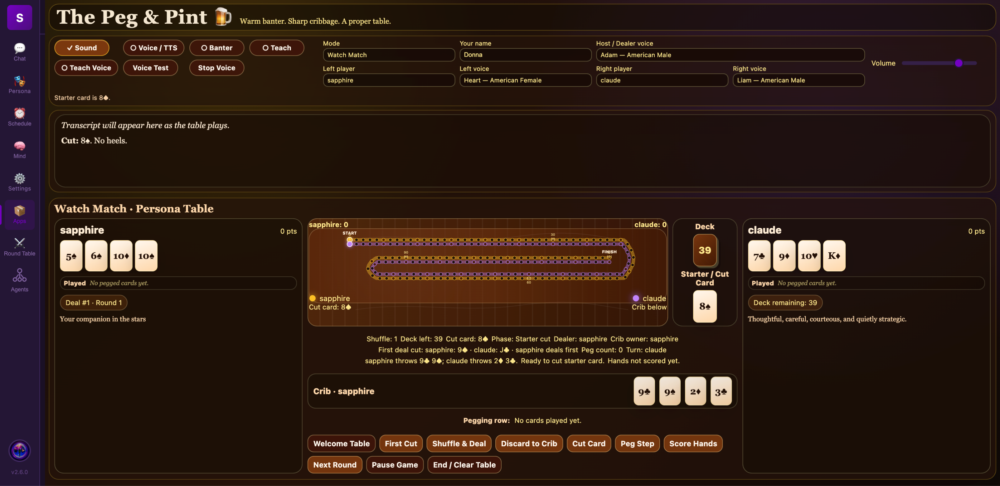

# The Peg & Pint 🍺 v0.2.1

Warm banter. Sharp cribbage. A proper table.

## Screenshot

This is the first public release of **The Peg & Pint**, a cozy tavern-style cribbage plugin for SapphireAI.

The Peg & Pint brings a playable cribbage table into Sapphire with a warm pub atmosphere, persona table energy, guarded voice/sound hooks, and an early but working cribbage game flow.

## What’s included

- Opening cut for deal
- Shuffle and deal
- Discard to crib
- Starter cut
- Pegging flow
- Hand and crib scoring
- Right jack / nobs scoring
- Human-vs-persona play
- Teaching mode support
- Voice and sound toggles
- Traditional cribbage-board-inspired layout
- Cozy tavern/pub visual theme

## Current game flow

The main play sequence is:

1. First Cut
2. Shuffle & Deal
3. Discard to Crib
4. Cut Starter
5. Peg Step
6. Score Hands

## Notes

This is an early playable release focused on getting the core table, cribbage flow, and Sapphire integration working cleanly.

Future updates may improve persona strategy, teaching mode, watch-mode persona matches, board animation, and table-host personality.

## Created by

Created by **Donna Angelle / shroomshaolin** for the SapphireAI plugin ecosystem.
